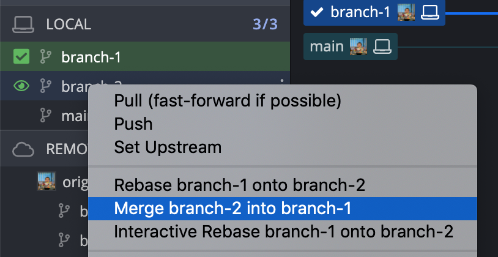
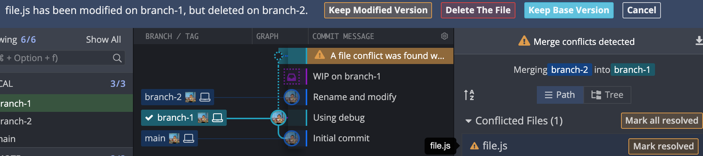
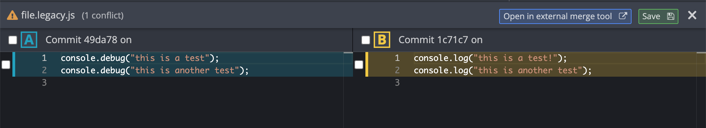

### How to reproduce

1. Open in GitKraken
2. Checkout `branch-1` and `branch-2` localy
3. Checkout `branch-1`
4. Right-click on `branch-2` and click `Merge branch-2 into branch-1` 
5. Click on the conflicted file `file.js`. Notice the conflict resolution proposed by GitKraken 
6. Abort the merge
7. Open the terminal from Mac OS (not the one from GitKraken) and navigate to the repo folder
8. Execute command `git merge branch-2`
9. Go back to GitKraken, and click on the conflicted file `file.js`.
10. Observe the different conflict resolution 

### Expected behaviour

Making a merge with GitKraken should have the same outcome as making a merge using the git command line
